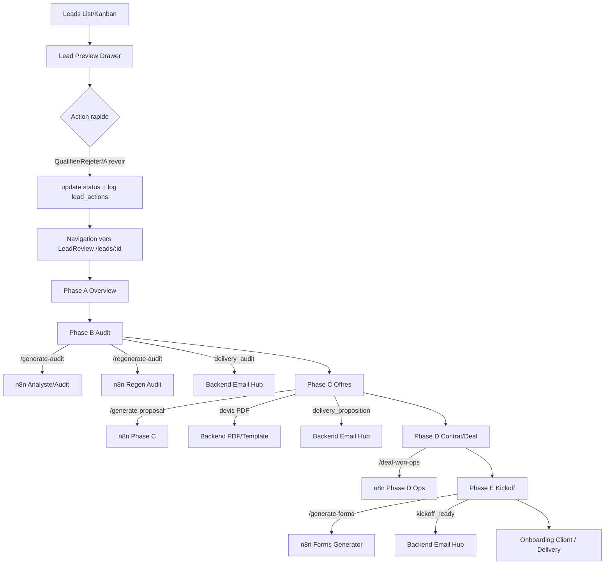

# Lead Preview: etapes, workflows n8n, dependances et integration app

Date: 2026-04-06
Perimetre: experience Lead Preview (drawer) + Lead Review (pipeline detail) dans Pretalk Hub

## 1) Vue d'ensemble du Lead Preview

Dans l'app, le "Lead Preview" est compose de 2 niveaux:

1. Niveau rapide (preview): `LeadDetailsDrawer` ouvre un panneau de contexte depuis la page `Leads`.
2. Niveau complet (execution): `LeadReview` sur la route `/leads/:id` pilote les phases A->F.

Le flux reel est donc:

1. Consultant ouvre un lead dans la liste/kanban.
2. Il fait une action rapide (qualifier, rejeter, a revoir) depuis le drawer.
3. Il bascule sur `LeadReview` pour produire audit, offres, contrat et kickoff.

## 2) Structure des etapes Lead Preview -> Lead Review

## Etape 0 - Ouverture du lead

Objectif:
- Afficher le contexte du lead sans quitter la vue `Leads`.

Composants/source:
- `Leads` charge les leads et ouvre `LeadDetailsDrawer`.
- `LeadDetailsDrawer` affiche score, statut, reponses, temperature, actions rapides.

Workflow n8n declenche:
- Aucun workflow n8n direct a l'ouverture seule.

Dependances:
- Table `leads` (contenu principal)
- Mapping `respondent_info`, `static_answers`, `dynamic_dialogue`

---

## Etape 1 - Actions rapides depuis Lead Preview

Objectif:
- Qualifier, rejeter ou marquer "a revoir" rapidement.

Composants/source:
- `LeadDetailsDrawer`
- Service `leadActions.ts`

Actions et workflows:

1. Qualifier (`newStatus = sent`)
- Etat lead mis a jour en base.
- Log dans `lead_actions`.
- Aujourd'hui: chemin n8n email desactive dans `triggerLeadQualificationWorkflow` (mode backend-only).

2. Rejeter (`newStatus = rejected`)
- Etat lead mis a jour.
- Log `lead_actions`.
- Aujourd'hui: notification n8n aussi bypassee (backend-only email path).

3. A revoir (`newStatus = reviewed`)
- Etat lead mis a jour.
- Log `lead_actions`.
- Rappel "review" surtout trace localement.

Relations:
- Cette etape prepare l'entree dans la phase de travail detaillee (`/leads/:id`).

---

## Etape 2 - Phase A (Overview) dans LeadReview

Objectif:
- Verifier qualification du lead avant production.

Composants/source:
- `LeadReview.tsx` (phase A)
- `PipelineSidebar`
- `LeadConsultationDrawer`

Workflow n8n declenche:
- Generation audit initiale via `N8N_GENERATE_AUDIT_WEBHOOK` (`/generate-audit`).

Dependances:
- Donnees formulaire (`form_id`, `static_answers`, `dynamic_dialogue`)
- Profil consultant (`userProfile`) pour contexte IA
- Rules auto-step (`useAutomationRules`) pour transitions statut

---

## Etape 3 - Phase B (Audit)

Objectif:
- Produire/editer l'audit, generer le PDF, puis envoyer.

Workflows n8n / backend:

1. Regeneration audit
- `N8N_REGENERATE_AUDIT_WEBHOOK` (`/regenerate-audit`)

2. IA assistance texte (micro-ameliorations)
- `N8N_AI_ASSIST_TEXT_WEBHOOK` (`/ai-assist-text`)

3. Generation PDF audit
- Pipeline PDF backend (`generatePdfViaBackend`) avec templates
- Lie aux flux n8n PDF (workflow audit PDF) selon config infra

4. Envoi audit
- `sendAppTemplateEmail` (backend email hub)
- Event type: `delivery_audit`

Dependances:
- `leads.ai_analysis_json`
- `leads.final_report_pdf`
- `leads.pdf_settings`
- `bookings` (lien meeting dans email)

---

## Etape 4 - Phase C (Offres/Proposals)

Objectif:
- Generer les offres, preparer devis PDF, envoyer proposition.

Workflows n8n / backend:

1. Generation offres
- `N8N_GENERATE_PROPOSAL_WEBHOOK` (`/generate-proposal`)

2. Devis PDF
- Generation PDF via backend (`generatePdfViaBackend`, template `devis`)
- Le fichier n8n de devis existe cote repo (`Pretalk_-_Generate_Devis_PDF_v1.json`) mais le runtime passe aujourd'hui surtout par backend PDF.

3. Envoi proposition
- `sendAppTemplateEmail` event `delivery_proposition`

Dependances:
- `leads.proposals_json` (options + payloads de template)
- `proposalPdfUrls` (URLs de devis)
- Email client dans `respondent_info.email`
- Statut lead passe a `proposition_sent` apres envoi

Relations inter-etapes:
- Phase C depend d'un audit exploitable (phase B).
- Les sorties C alimentent directement D (contrat/deal).

---

## Etape 5 - Phase D (Contrat / Conversion)

Objectif:
- Convertir le lead en client et declencher les operations post-vente.

Workflows n8n:

1. Deal won ops
- `N8N_DEAL_WON_OPS_WEBHOOK` (`/deal-won-ops`)
- Declenche lors de conversion payee (`deal.status = paid`) ou generation contrat

Donnees gerees:
- Table `deals` (upsert deal)
- Mise a jour `leads.status = won`

Dependances:
- Deal cree et coherent (`deal_id` requis pour appels ops)
- Donnees consultant (nom, email, locale)

Relations inter-etapes:
- D consomme les offres validees de C.
- D debloque E (kickoff).

---

## Etape 6 - Phase E (Kickoff)

Objectif:
- Generer un formulaire kickoff personnalise et l'envoyer au client.

Workflows n8n / backend:

1. Generation formulaire kickoff
- `N8N_GENERATE_FORMS_WEBHOOK` (`/generate-forms`)
- Retour attendu: `form_slug`

2. Envoi email kickoff
- `sendAppTemplateEmail` event `kickoff_ready`

Dependances:
- `leads.kickoff_form_slug`
- URL publique profil/form (`https://pretalk.me/{username}/{form_slug}`)
- Email client valide

Note de coherence importante:
- `generate-forms` cree le formulaire complet + slug.
- `generate-form-fields` ne cree que des suggestions de questions et ne doit pas remplacer `generate-forms` pour le kickoff final.

---

## Etape 7 - Phase F (Finance)

Objectif:
- Consolider la partie finance (suivi et operations).

Etat actuel:
- Phase presente dans le stepper UI.
- Niveau implementation workflow moins explicite dans `LeadReview` que B/C/D/E.

## 3) Relations entre etapes (dependances fonctionnelles)

Dependances critiques:

1. A -> B
- Sans contexte lead/form fiable, audit IA degrade ou invalide.

2. B -> C
- Proposals dependaient de l'analyse/audit et du profil consultant.

3. C -> D
- Contrat et conversion reposent sur offre choisie et deal structurable.

4. D -> E
- Kickoff est pertinent uniquement apres conversion/won et deal valide.

5. E -> Operations globales
- Le kickoff alimente le demarrage delivery/client onboarding.

Points de fragilite actuels:

1. Plusieurs transitions restent manuelles (statut et declenchements).
2. Le passage preview -> review est partiellement heterogene (ex: lien propose `/lead-review/:id` alors que la route active est `/leads/:id`).
3. Email et workflow peuvent suivre des chemins differents selon action (backend-only vs n8n direct).

## 4) Relation du Lead Preview avec le reste de l'app

Couche UI:

1. `Leads` (liste/kanban) est le point d'entree operationnel.
2. `LeadDetailsDrawer` couvre decision rapide.
3. `LeadReview` couvre orchestration complete du cycle lead->deal.

Couche donnee (Supabase):

1. `leads`: objet central pipeline.
2. `deals`: conversion commerciale.
3. `bookings`: lien consultation et CTA email.
4. `lead_actions`: audit trail des actions preview.
5. `lead_generation_states` et `pipeline_state`: suivi de progression/generation.

Couche automation:

1. n8n webhooks pour generation IA et operations.
2. Backend email hub via `sendAppTemplateEmail` pour envois transactionnels.
3. Realtime/polling pour rafraichir l'etat (notamment generation PDF/proposals).

## 5) Schema de flux (Lead Preview -> Pipeline complet)

## 6) Liste des fonctionnalites et workflows

Fonctionnalites principales Lead Preview/Review:

1. Visualisation rapide du lead (score, statut, reponses, temperature).
2. Changement de statut rapide depuis drawer.
3. Edition complete audit + visualisations + PDF.
4. Generation d'offres IA et preparation de devis PDF.
5. Envoi transactionnel audit/proposition/kickoff.
6. Conversion deal et progression pipeline.
7. Generation formulaire kickoff et lien client public.
8. Sauvegarde auto + protection contre perte de modifications.
9. Realtime + polling de synchronisation.

Workflows/points d'integration utilises:

1. `/generate-audit`
2. `/regenerate-audit`
3. `/ai-assist-text`
4. `/generate-proposal`
5. `/deal-won-ops`
6. `/generate-forms`
7. Event email `delivery_audit`
8. Event email `delivery_proposition`
9. Event email `kickoff_ready`

## 7) Ameliorations UI/UX recommandees

Priorite haute:

1. Unifier la navigation preview -> review
- Corriger le deep link du drawer vers la route canonique `/leads/:id`.

2. Rendre visibles les preconditions de phase
- Afficher un "checklist gate" clair (ex: email client manquant, deal absent, PDF non genere).

3. Uniformiser feedback d'action
- Remplacer les `window.confirm/prompt` restants par modales/toasts homognes.

4. Clarifier etat automation vs manuel
- Afficher explicitement "declenche automatiquement" ou "action manuelle requise" sur chaque bouton de phase.

Priorite moyenne:

1. Timeline pipeline lisible
- Ajouter une timeline chronologique (actions utilisateur + reponses workflow + changements statut).

2. Etat de synchronisation technique
- Ajouter un indicateur discret: "Sync realtime OK / fallback polling".

3. Optimiser actions groupes phase C
- Permettre preselection d'offres, generation devis batch, et recapitulatif avant envoi.

4. Accessibilite et mobile
- Revoir contraste badges score/statut, tailles cibles tactiles, navigation clavier dans drawers/modales.

Priorite long terme:

1. Automatiser davantage les handoffs inter-phases
- Reducer les ruptures manuelles entre statut, generation, email et conversion.

2. Observabilite workflow orientee metier
- Dashboard simple par lead: dernier workflow, duree, succes/erreur, action recommandee.

---

## 8) Synthese

Le Lead Preview est solide sur l'analyse rapide et l'orientation vers la page `LeadReview`, mais la chaine complete reste hybride (automations + transitions manuelles). Le potentiel de gain principal est l'unification des handoffs entre phases et la clarification UX des dependances avant action.